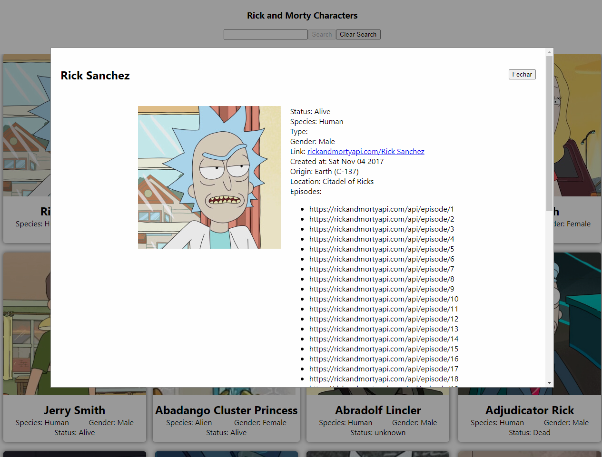

# Rick and Morty Search

This is a project made as a technical test for [RankMyApp](https://www.rankmyapp.com/en/)

It is a React app that uses axios to consume the [rickandmortyapi](https://rickandmortyapi.com/) and list all the characters in a grid
It is also possible to search for a character by name and see its information on a modal.

## Technologies used

- React
- CSS
- Axios
- [React Infinite Scroll](https://www.npmjs.com/package/react-infinite-scroll-component)

## Running the application locally

- Clone this repo;
- Install the dependencies with `yarn`;
- Start the server with `yarn start`;
- Open it on the browser at [http://localhost:3000](http://localhost:3000)

## Screenshots

### Home

### Home with search

### Modal
